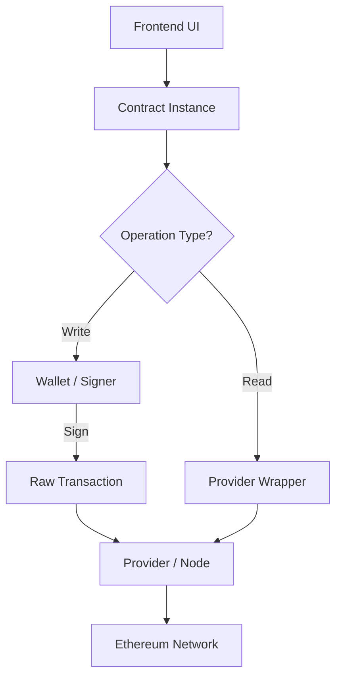

# 🌐 Ethereum Frontend Libraries: Ethers.js

Interacting with Ethereum via raw JSON-RPC is complex and error-prone. Frontend libraries like **Ethers.js** abstract this complexity, allowing developers to focus on logic rather than byte-level transaction construction.

---

### 🧠 1. Why Use Libraries?

| Requirement | Manual (JSON-RPC) | Library (Ethers.js) |
| :--- | :--- | :--- |
| **Experience** | ❌ Complex & Time-consuming | ✅ Simple & Modern API |
| **Transaction Signing** | ❌ Hardcoded/Manual | ✅ Integrated Wallet Management |
| **ENS Support** | ❌ Required manual resolution | ✅ Built-in Support |
| **Byte Manipulation**| ❌ Manual Buffer/Hex math | ✅ Automatic Encoding |

**Architecture Snapshot:**
`Your App` → `Ethers.js` → `JSON-RPC` → `Ethereum Node`

---

### 🔧 2. The Core Triad (Components)

In Ethers.js, functionality is split into three main entities. Mastering these is critical for any developer or auditor.

| Component | Role | Security/Developer Analogy |
| :--- | :--- | :--- |
| **🌐 Provider** | **Connection** | The "Read-only" observer. Connects to the network. |
| **👛 Wallet** | **Identity** | The "Pen". Holds the private key and signs transactions. |
| **📜 Contract** | **Interface** | The "Instruction set". Represents the logic at a specific address. |

#### 📖 Read vs 🔒 Write
*   **Read (Query State):** Requires only a **Provider**. No gas, no private key.
*   **Write (Change State):** Requires **Contract + Wallet + Provider**. Requires gas and a signature.

---

### 🔗 3. Execution Flow

Understanding how these components interact to move a request from your UI to the blockchain:



---

### 🧩 4. From Low-Level to High-Level

Ethers.js doesn't replace the concepts of **Nonce**, **Gas**, or **Calldata**—it just automates them.

**Old Manual Way:**
1. Fetch Nonce.
2. Build Transaction Object.
3. Hex-encode Calldata.
4. Sign with Private Key.
5. Send Raw Transaction.

**New Ethers.js Way:**
```javascript
// One line of code handles all 5 manual steps
await contract.transfer(recipient, amount);
```

> [!CAUTION]
> **Audit Tip:** Just because the library makes it easy to send data doesn't mean the data is safe. Always remember: **Calldata is untrusted input** from the contract's perspective, even if `ethers.js` formatted it perfectly for the user.

---

### 🔥 Key Audit Takeaways
*   **Provider = Observer.** If an app only needs to show balances, it should never request wallet access.
*   **Wallet = Identity.** The library protects the private key, but the app must handle the `msg.sender` logic correctly.
*   **Contract = Abstraction.** The ABI (Application Binary Interface) tells Ethers how to talk to the contract; if the ABI is wrong, the transaction will fail or behave unexpectedly.